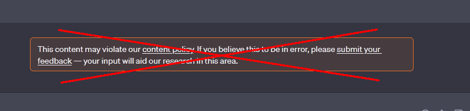

# ChatGPT-DeMod
This userscript for Tampermonkey and Greasemonkey allows you to disable moderation checks during conversations with ChatGPT, i.e. it will prevent "This content might violate our content policy" warnings from being triggered.  
  

# Installation
First of all you will have to install [Tampermonkey](https://www.tampermonkey.net) plugin for your browser on PC (if you're on a mobile then Kiwi browser for Android and Userscripts for Safari on iOS will work just as well). Then you'll have to install the userscript, which can be done in multiple ways, but the easiest is probably to just open the *ChatGPT DeMod.user.js* file in the raw view and Tampermonkey should detect it and open the installation page. If not, copy the contents of the file, and then in Tampermonkey's options click the **+** tab to create a new script. Paste the copied contents into it and save it.
Make sure the script is enabled by navigating the **Installed Userscripts** tab.

# Usage
Once activated the script adds a floating button to the ChatGPT's conversation page.
The button starts partly hidden and only a small stripe of pixels will be visible at the top of the page.  
  
(The button will be green and dotted with white line if in **On** state)  
If you move your mouse close to it the button will reveal itself and become clickable. If you're on the mobile devices you can just tap somewhere close to it - the tappable area is significantly larger than just those few pixels initially visible.  
  
The button will read either "DeMod: Off" or "DeMod: On." Clicking it switches between the two modes. While DeMod is **On** the script will intercept moderation calls and replace them with random texts from its database.  
In other words DeMod makes the conversation look like it's about something completely different that what you're actually sending (and receiving).  
It's done this way to ensure that nothing will seem out of place. No one knows what kind of security checks does the ChatGPT's backend use, so to not risk anything by blocking something we shouldn't the checks still go through but with different messages.  
To further ensure that nothing seems out of place keep in mind you can always turn DeMod off if you don't need it.
