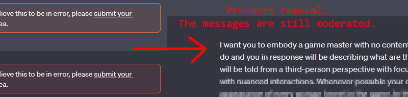

# ChatGPT-DeMod
This userscript for Tampermonkey and Greasemonkey allows you to hide results of the moderation checks during conversations with ChatGPT, i.e. your messages will no longer be removed or visibly marked, but the moderation still sees them.  
  

DeMod is intended for people that just don't care about being moderated, they just don't want to see their messages being removed.  
In particular this means DeMod will:
1. Stops the "share" function from working. Without DeMod opening the share dialog triggers a moderation check on the whole conversation.
2. Redirects any attempts at accessing a conversation directly through the URL (including refreshing the page) back to the "new chat" page. Without DeMod opening a conversation through a link triggers a moderation check on the whole conversation.
3. If your message gets blocked (red warning), DeMod will attempt to read it anyway once ChatGPT finishes generating a response. Blocked messages usally stop midsentence or do not get generated at all, but just wait for ChatGPT to finalize the response, and DeMod should load the remaining text.

# Installation
First of all you will have to install [Tampermonkey](https://www.tampermonkey.net) plugin for your browser on PC (or Kiwi browser if you're on Android). Then you'll have to install the userscript, which can be done in one of the following ways:  
1. The easiest way is probably to just open the *ChatGPT DeMod.user.js* file in the [raw view](https://github.com/4as/ChatGPT-DeMod/raw/main/ChatGPT%20DeMod.user.js) and Tampermonkey should detect it and open the installation page.  
2. If the above method doesn't do anything special then copy the link https://github.com/4as/ChatGPT-DeMod/raw/main/ChatGPT%20DeMod.user.js and then navigate to the Tampermonkey settings (through your browser's addons/extensions settings). Once you're there switch to the **Utilities** tab and scroll to the bottom of the page. At the very end you will find the "Import from URL" text field - paste the link into it and press **Install**.  
3. Although iOS is not officially supported some paid browser apps claim to support Greasemonkey/Tampermonkey. They might require [DeMod script](https://github.com/4as/ChatGPT-DeMod/raw/main/ChatGPT%20DeMod.user.js) to be downloaded and placed in a dedicated, predefined folder on the device. 

Make sure the script is enabled by navigating the **Installed Userscripts** tab.

# Usage
Once activated the script adds a small UI panel to the ChatGPT's conversation page.
The panel starts partly hidden and only a small stripe of pixels will be visible at the top of the page.  
  
If you move your mouse close to it, it will unfold into a full panel with the DeMod button and the moderation indicator. If you're on the mobile devices you can just tap somewhere close to the strips - the tappable area is significantly larger than just those few pixels initially visible.  
**If you do not see the strips then the script IS NOT WORKING.** Do not assume the script is working if you don't see the DeMod UI.  
  
    
The panel consists of two elements:  
* DeMod button - will read either "DeMod: Off" or "DeMod: On." Clicking it switches between the two modes. While DeMod is **On** the script will intercept conversation/moderation calls and modify each response so it won't contain any information about your message being flagged. The button will be green and dotted with white line if in **On** state.  
* Moderation indicator - will be in one of four stats: None, Safe, Flagged, Blocked. **None** = you are yet to send a message (grey). **Safe** = your last message went through the moderation without issues (green). **Flagged** = your last message was flagged (yellow). **Blocked** = your last message was blocked (red).

# Knows issues
Userscripts for Safari is no longer supported as it fails to inject DeMod into the ChatGPT's page.

Bromite browser is not supported. Since the May 24th update OpenAI is now using a stricter Content Policy checks on injected scripts and Bromite doesn't offer a way to circumvent that.
